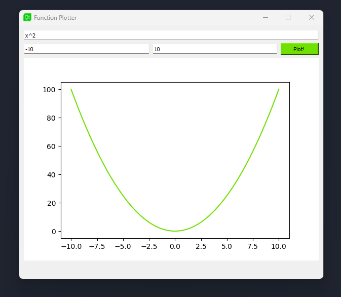
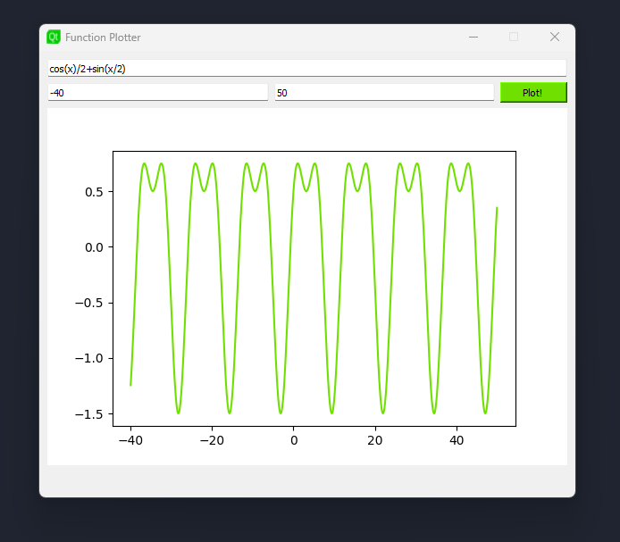
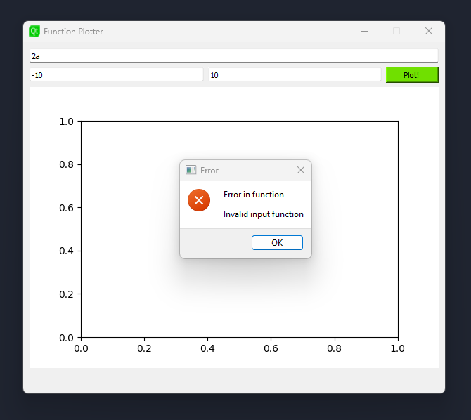
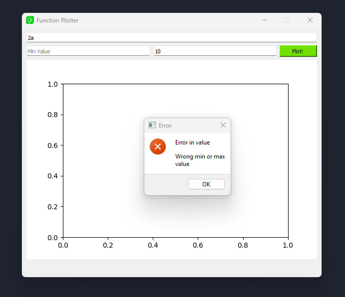

# Function Plotter 🕹

A simple function plotter that allows you to plot mathematical functions in a graphical window using Pyside2.

## Features

* Plots a variety of mathematical functions, including polynomials, trigonometric functions, and exponential functions.
* Allows you to specify the range of values that the function should be plotted over.
* Uses the matplotlib library to create the graphical window.
* Tested using the pytest-qt plugin.

## Usage

1. Enter the function you want to plot in the `Enter Function` text box.
2. Enter the minimum and maximum values of the function in the `Min Value` and `Max Value` text boxes.
3. Click the `Plot!` button.

## Demo

  
  
  
  

## Requirements

* Python 3.7
* Pyside2
* matplotlib
* numpy
* sympy

## Running the program
To run the program, simply execute the following command from the command line:
`python app.py`

## Running the testing 
To run the program, simply execute the following command from the command line:
`pytest -q test.py`

## Contributing
Contributions are welcome! Please open an issue or a pull request if you have any ideas for improvements.

I hope you enjoy using the function plotter!

This README file created with the help of BARD. 
